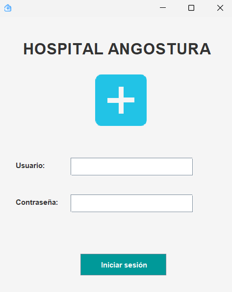
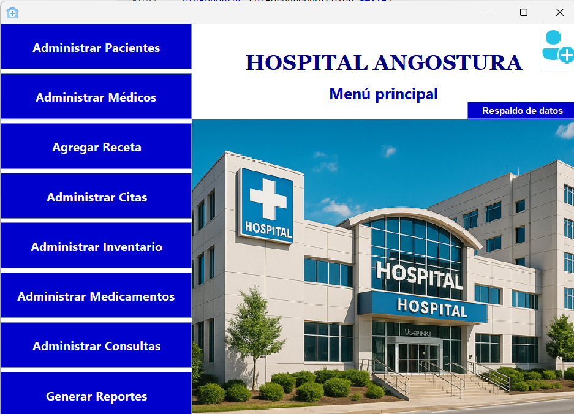
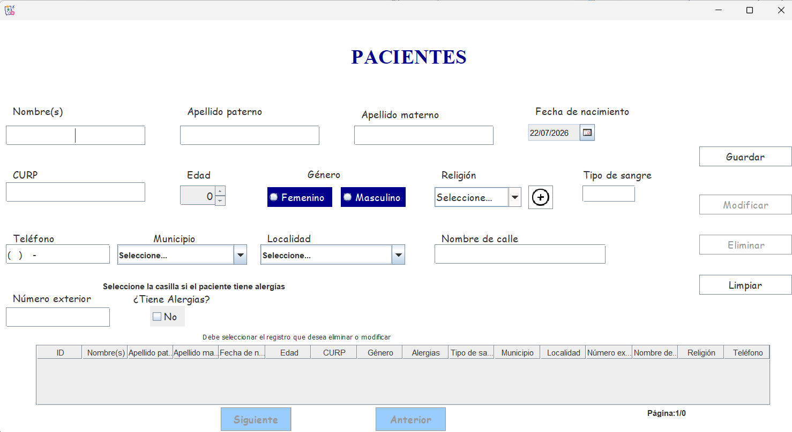
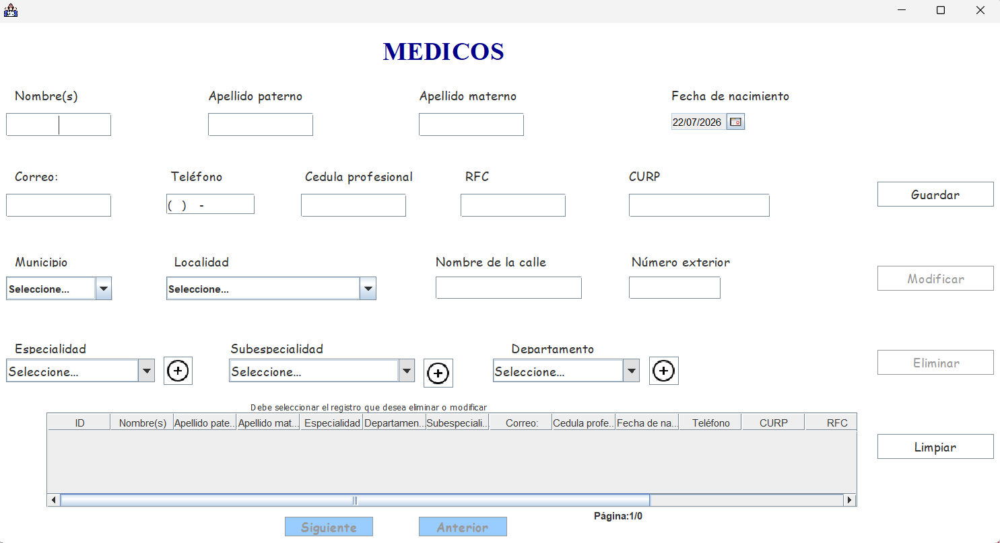
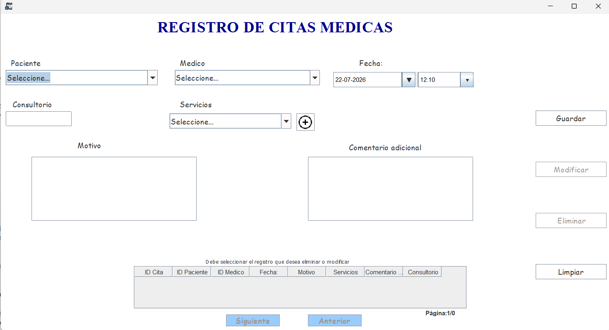
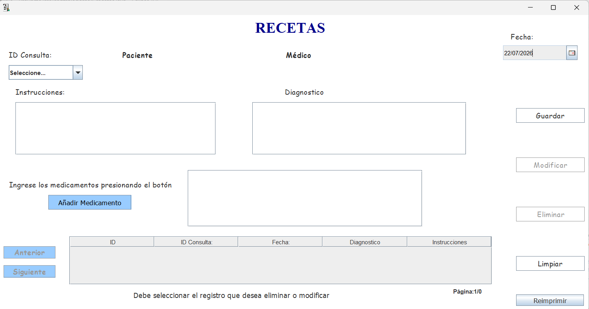
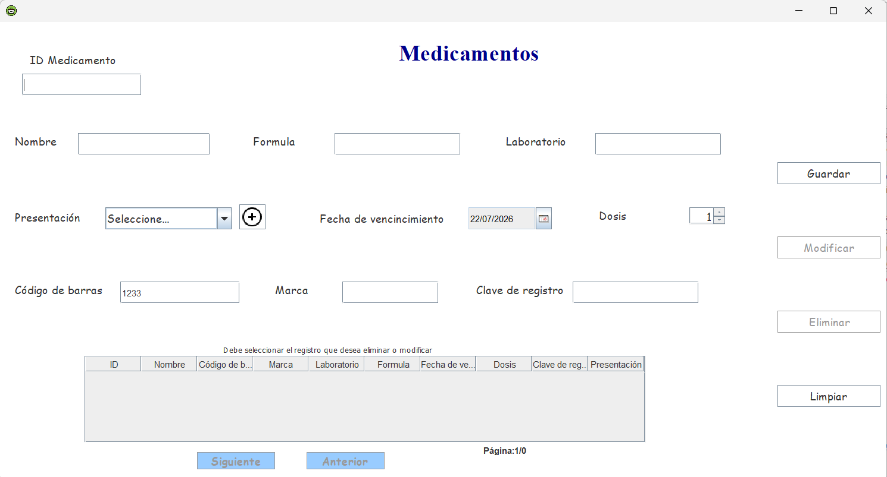
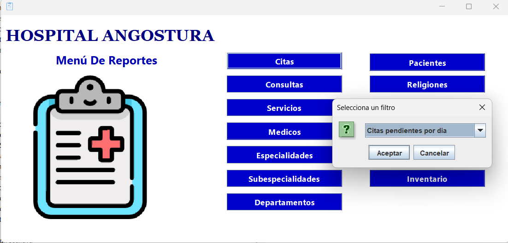

# 🏥 Proyecto escolar: "Gestión de consultorios Hospital Angostura"


##  Descripción

Sistema de gestión hospitalaria desarrollado como una solución de escritorio para optimizar la administración de procesos clínicos y administrativos.
La aplicación permite gestionar pacientes, médicos, citas, recetas y medicamentos mediante una interfaz gráfica intuitiva. Además, incorpora un módulo de inventario inteligente con validación mediante código de barras, facilitando el control y registro de medicamentos.
El proyecto fue desarrollado aplicando principios de **Programación Orientada a Objetos**, utilizando la arquitectura **Modelo - Vista - Controlador (MVC)** y una base de datos relacional para garantizar un manejo eficiente de la información.

---

#  Objetivo del proyecto

Desarrollar una aplicación de escritorio que facilite la administración de la información hospitalaria, permitiendo centralizar procesos como la gestión de pacientes, médicos, citas, recetas e inventario de medicamentos, mejorando la organización y eficiencia de las operaciones.

---

#  Funcionalidades principales

*  Inicio de sesión de usuarios.
*  Gestión de pacientes.
*  Administración de médicos.
*  Registro y control de citas médicas.
*  Gestión y emisión de recetas médicas.
*  Gestión de medicamentos.
*  Control de inventario de medicamentos.
*  Consulta de medicamentos mediante código de barras.
*  Registro automático de nuevos medicamentos cuando el código no existe en el sistema.
*  Operaciones CRUD (Crear, Leer, Actualizar y Eliminar).
*  Conexión con base de datos SQL Server.

---

#  Tecnologías utilizadas

### Lenguaje de programación
* Java

### Interfaz gráfica
* Java Swing

### Base de datos
* SQL Server

### Conectividad
* JDBC

### Arquitectura de software
* Modelo - Vista - Controlador (MVC)

### Herramientas utilizadas

* Eclipse IDE
* SQL Server Management Studio

---

#  Arquitectura del sistema
El sistema implementa la arquitectura **Modelo - Vista - Controlador (MVC)**, permitiendo separar la interfaz gráfica, la lógica del negocio y el acceso a los datos para facilitar el mantenimiento y la escalabilidad del software.

```text
              Usuario
                 │
                 ▼
        Vista (Java Swing)
                 │
                 ▼
            Controlador
                 │
                 ▼
              Modelo
                 │
                 ▼
      Base de Datos SQL Server
```

### Componentes

**Modelo**
Gestiona la estructura de los datos y la comunicación con la base de datos.

**Vista**
Contiene las interfaces gráficas con las que interactúa el usuario.

**Controlador**
Procesa las acciones del usuario y coordina la comunicación entre la vista y el modelo.

---

#  Capturas del sistema

##  Inicio de sesión



---

##  Pantalla principal



---

##  Gestión de pacientes



---

##  Gestión de médicos



---

##  Gestión de citas



---

##  Gestión de recetas



Este módulo permite registrar y administrar las recetas médicas emitidas durante la atención de los pacientes, asociando los medicamentos prescritos para mantener un historial organizado y facilitar su consulta.

---

##  Gestión de medicamentos



El sistema incorpora una funcionalidad de consulta mediante código de barras. Al escanear o ingresar un código, verifica si el medicamento existe en la base de datos. Si existe, recupera automáticamente su información para actualizar el inventario; de lo contrario, habilita el formulario para registrar un nuevo medicamento.

---

##  Reportes



El módulo de reportes permite consultar y organizar la información registrada en el sistema, facilitando el seguimiento de la actividad hospitalaria y apoyando la toma de decisiones administrativas.

---

#  Conocimientos aplicados

Durante el desarrollo del proyecto se aplicaron conocimientos relacionados con:

* Programación Orientada a Objetos.
* Análisis y modelado de software.
* Diseño de aplicaciones empresariales.
* Arquitectura MVC.
* Desarrollo de interfaces gráficas.
* Manejo de bases de datos relacionales.
* Consultas SQL.
* Integración de lectores de código de barras.
* Gestión de inventarios.
* Desarrollo de software para el sector salud.


---

#  Aprendizajes del proyecto

Este proyecto permitió fortalecer habilidades en el desarrollo de aplicaciones empresariales mediante la implementación de una solución para el sector salud. Se aplicaron buenas prácticas de organización del código, diseño de software y administración de bases de datos.
Además, se desarrolló una lógica de negocio para la gestión de medicamentos mediante códigos de barras, optimizando el proceso de consulta, registro y actualización del inventario, una funcionalidad utilizada comúnmente en sistemas hospitalarios reales.

---

#  Autor

**Kalecxa Guadalupe Sandoval Encines**

**Proyecto escolar en colaboración con Lilian Tapia y Milagros Camacho**

Estudiante de Ingeniería en Sistemas Computacionales.


GitHub: **@kalest05**
